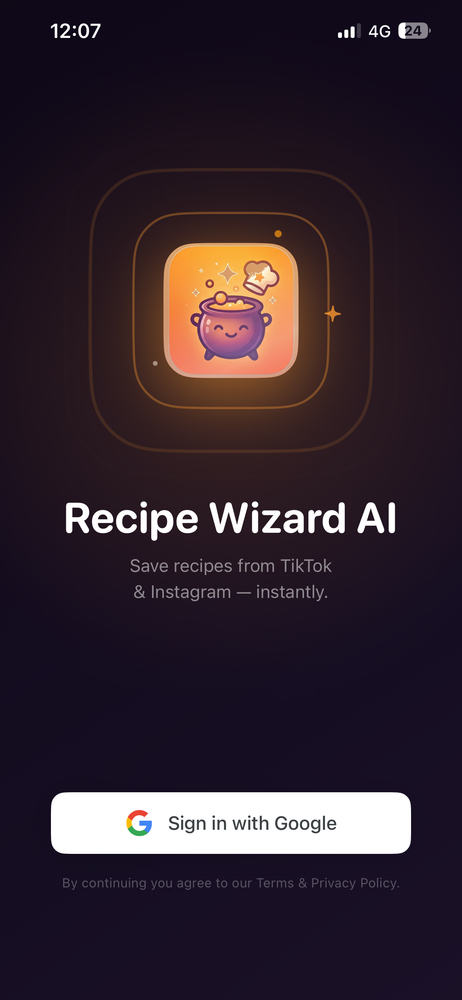
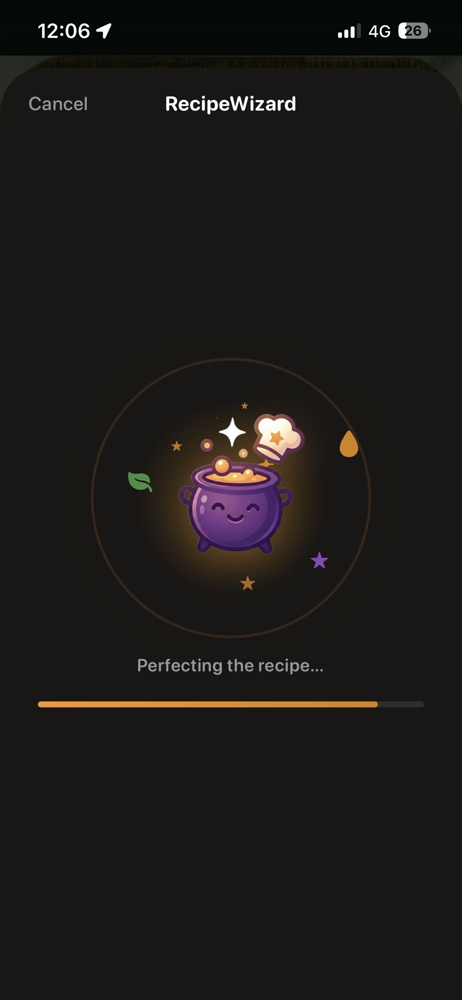
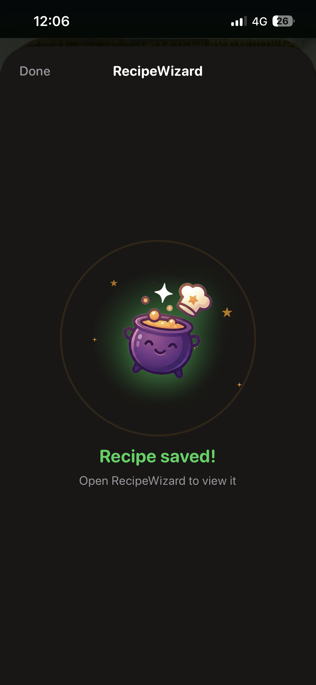
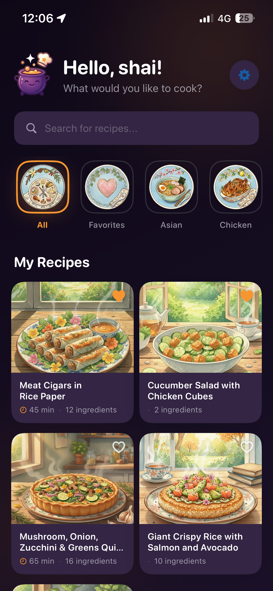

# RecipeWizard

A personal iOS app for saving recipes from TikTok and Instagram Reels. Share a video to the app and AI automatically extracts the recipe — ingredients, steps, cook time, and more — and saves it to your recipe book.

Inspired by [Honeydew](https://honeydewcook.com/).

---

## How it works

#### 1. Sign in with Google



Open the app and sign in once with your Google account. Your recipe book is tied to your account so it's always available.

---

#### 2. Share any TikTok or Instagram recipe video


While browsing TikTok or Instagram, tap the share button on any recipe video and select **RecipeWizard** from the share sheet. You never have to leave your feed.

---

#### 3. Cauldy the Wizard gets to work



The app fetches the video metadata, reads the caption, and sends everything to Claude AI to extract a structured recipe. Cauldy dances while he cooks it up — the whole thing takes about 20 seconds.

---

#### 4. Recipe saved



Done. The recipe is saved to your book. The sheet closes automatically and you're back in your feed.

---

#### 5. Browse your recipe book


All your saved recipes in one place. Search by name or tag, and favorite the ones you make most. The two-column grid shows the recipe thumbnail, cook time, and ingredient count at a glance.

---

#### 6. Smart category filters



The category strip along the top automatically sorts your recipes into groups like **Asian**, **Chicken**, **Healthy**, **Dessert**, and more — by matching the recipe title and tags against a keyword list. Categories only appear once you have at least one recipe that fits. Tap **Favorites** to see recipes you've hearted, or tap any other category to instantly filter down.

---

#### 7. Studio Ghibli–style AI illustrations


Every recipe gets a unique illustration generated by **Gemini 2.5 Flash** — prompted to paint the dish in a Studio Ghibli / Hayao Miyazaki watercolor style. Soft textures, warm golden light, cozy atmosphere. No two look the same. The image is generated from the recipe title right after extraction and stored with the recipe.

---

#### 8. Cook from the recipe


Tap any recipe to see the full details — ingredients, step-by-step instructions with per-step timers, and a link back to the original video. Tap an ingredient to check it off as you cook.

---

## Repository structure

```
recipewizard/
├── iOS/              # iOS app (SwiftUI + SwiftData)
│   ├── RecipeWizard.xcodeproj
│   ├── RecipeWizard/         # Main app target
│   ├── ShareExtension/       # iOS Share Extension
│   └── Shared/               # Code shared between both targets
├── backend/          # Node.js/TypeScript backend
│   └── src/
└── docs/             # Setup guides
```

---

## Quick start

### 1. Backend

**Prerequisites:** Node.js 20+, yt-dlp installed globally, an Anthropic API key.

```bash
# Install yt-dlp
brew install yt-dlp          # macOS
# or: pip install yt-dlp

# Set up backend
cd backend
npm install
cp .env.example .env
# Edit .env — add your ANTHROPIC_API_KEY
npm run dev
# Backend runs on http://localhost:8000
```

Test it:
```bash
curl -X POST http://localhost:8000/api/v1/extract \
  -H "Content-Type: application/json" \
  -d '{"url": "https://www.tiktok.com/@gordonramsay/video/...", "include_thumbnail": true}'
```

### 2. iOS app

**Prerequisites:** Xcode 15+, a device running iOS 17+ (simulator cannot test the Share Extension or CloudKit).

```bash
open iOS/RecipeWizard.xcodeproj
```

In Xcode:
1. Select the **RecipeWizard** target → **Signing & Capabilities** tab
2. Set your **Team** (free personal team works for USB device testing)
3. Change the **Bundle Identifier** to something unique (e.g. `com.yourname.recipewizard`)
4. Do the same for the **ShareExtension** target, using `com.yourname.recipewizard.ShareExtension`
5. Add the **App Groups** capability to **both** targets and use the same group ID (e.g. `group.com.yourname.recipewizard`)
6. In `iOS/Shared/SharedConstants.swift`, update `appGroupID` and `backendURL` to match

See [docs/SETUP.md](docs/SETUP.md) for a complete step-by-step walkthrough.

---

## Syncing with your partner

Currently recipes are stored locally on each device (SwiftData without CloudKit). Syncing between two phones requires an [Apple Developer Program](https://developer.apple.com/programs/) membership ($99/year).

Once you have a paid account, see [docs/CLOUDKIT.md](docs/CLOUDKIT.md) to enable two-device sync.

---

## Deploying the backend

For always-on use (so the Share Extension works when you're not on your Mac), deploy to Railway:

```bash
npm install -g @railway/cli
railway login
cd backend
railway init
railway up
# Set ANTHROPIC_API_KEY in the Railway dashboard
```

Then update `SharedConstants.backendURL` in the iOS app to your Railway URL.

---

## Tech stack

| Layer | Tech |
|-------|------|
| iOS app | SwiftUI, SwiftData, iOS 17+ |
| Share Extension | UIKit + SwiftUI |
| Backend | Node.js 20, TypeScript, Express |
| Video extraction | yt-dlp |
| AI | Claude claude-sonnet-4-6 (Anthropic) |
| Sync (future) | CloudKit |
